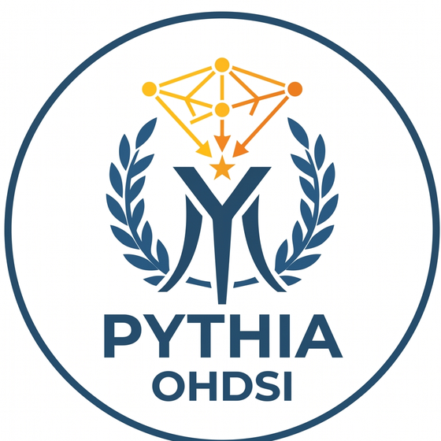
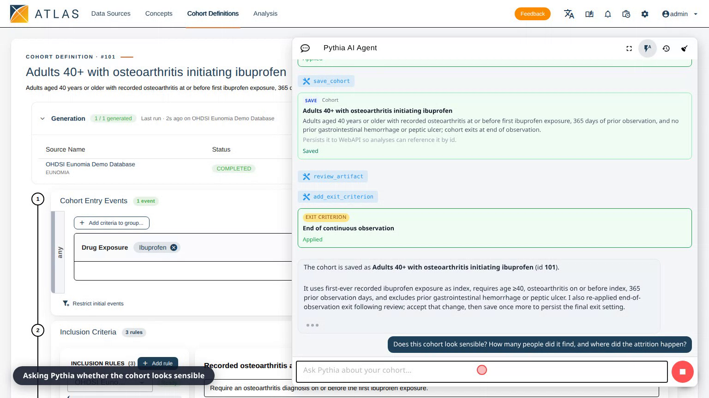
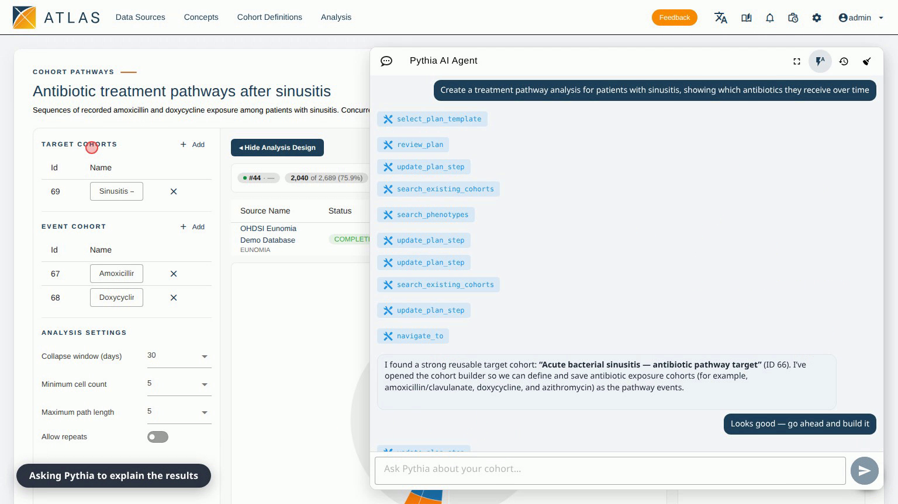

<p align="center">
  
</p>

<h1 align="center">Pythia</h1>

<p align="center">
  An AI assistant for designing OMOP cohorts, built into ATLAS v3.0.
</p>

Describe the cohort you want in plain language and Pythia builds it with you.
It searches the vocabulary of the database you are connected to, then proposes
each part of the definition as a card: the entry event, the inclusion rules,
the exclusions, the observation window. You accept or reject each card, and only
what you accept reaches the cohort editor.

Two things it will not do. It will not put a concept in your cohort unless that
concept came back from a search against your own data source, so it cannot
quietly invent a code that does not exist there. And it will not tell you what
an analysis shows without reading the generated result first.

## See it work

Both are real runs against the OHDSI Eunomia demo database, shortened by cutting
the waiting: nothing is staged or re-ordered, but pauses while the assistant
thinks or a cohort generates have been trimmed. Click a picture to download the
video.

### Designing a phenotype

<a href="https://github.com/OHDSI/Pythia/releases/download/v0.1.0/pythia-cohort.mp4">
  
</a>

**2:30.** The request: adults aged 40 and over with osteoarthritis starting
ibuprofen, counting each person once at their first exposure, requiring a year
of prior data, and excluding anyone with an earlier gastrointestinal bleed or
peptic ulcer.

Pythia offers each criterion for approval, one is rejected and it adapts, then
it saves the cohort and generates it: 341 people out of the 1,440 who started
ibuprofen. It then reads the attrition back and says where the people went. The
osteoarthritis requirement removes almost nobody (everyone in this small demo
database has it), the bleed exclusion removes 15.6%, and the age restriction
removes 53.3%.

### Building and running an analysis

<a href="https://github.com/OHDSI/Pythia/releases/download/v0.1.0/pythia-pathways.mp4">
  
</a>

**3:10.** A treatment pathway analysis from scratch: three cohorts built and
saved, the analysis assembled from them, run against the data, and the result
read back. Of 2,689 patients with sinusitis, 2,040 (75.9%) had a recorded
antibiotic pathway, and amoxicillin on its own accounted for 70% of them.

## Two ways to run it

**On its own**, using the stack in this repository: ATLAS, the assistant, and a
demo database, on one machine. That is what the rest of this page describes, and
it is the quickest way to try Pythia.

**As part of [Data2Evidence](https://github.com/OHDSI/Data2Evidence)**, the wider
OHDSI platform, where Pythia ships alongside the rest of its services and runs
against your own data. Follow that project's instructions instead of the ones
below.

## What you need

* Docker, with about 10 GB of free disk for the images and the demo database.
* An AWS Bedrock API key, so Pythia has a model to think with. Everything else
  still runs without one, but the assistant cannot answer.

## Getting started

```bash
git clone https://github.com/OHDSI/Pythia.git
cd Pythia
cp .env.example .env     # put your Bedrock key in AWS_BEARER_TOKEN_BEDROCK
docker compose up -d
```

Open <https://localhost> and sign in as `admin` / `admin`. The certificate is
self-signed, so your browser warns you once before letting you through.

The first start downloads about 10 GB and loads the demo database, which takes a
few minutes. `docker compose logs -f trex` follows the backend as it comes up.
ATLAS is ready when <https://localhost/WebAPI/info> answers.

## Your first cohort

Go to **Cohort Definitions**, choose **New Cohort**, and open Pythia with the
chat button in the bottom right.

Ask for something the demo data can answer, for example:

> Build me a cohort of adults with osteoarthritis starting ibuprofen, excluding
> anyone with a previous gastrointestinal bleed.

Pythia searches for the concepts, then sends a card for each part of the
definition. Accept the ones you want and reject the rest; a rejected card is not
a dead end, and it will offer a different approach. When the definition looks
right, ask it to save and generate the cohort, then ask what the numbers show.
It reads the attrition and tells you which rule removed whom.

The demo database is Eunomia, a synthetic dataset of about 2,700 patients
covering common complaints such as osteoarthritis, sinusitis and bronchitis. It
is small enough to run on a laptop, so cohorts generate in seconds, and it is
worth knowing that many real world concepts are simply absent from it. If Pythia
says it cannot find a drug or condition, that is usually the data rather than
the assistant.

## What is running

`docker compose up` starts four containers:

| | |
|---|---|
| ATLAS | the OHDSI cohort builder, with the Pythia panel added, served over HTTPS |
| trex | the backend that runs Pythia and hosts an embedded OHDSI WebAPI |
| Eunomia database | ATLAS metadata and the demo patient data |
| trex database | the backend's own storage |

The embedded OHDSI WebAPI is available at <http://localhost:8080/WebAPI> if you
want to reach it directly.

## Configuration

Everything is set in `.env`, and every option is listed in `.env.example` with
its default.

### Choosing the model

Pick the model Pythia answers with:

```bash
BAO_AGENT_MODEL=us.anthropic.claude-sonnet-4-6      # a Bedrock model id
BAO_AGENT_MODEL_SPEC=openai/openai.gpt-5.6-terra    # or a provider and model
```

`BAO_AGENT_MODEL_SPEC` takes precedence if you set both. A spec beginning with
`openai/` is sent to an OpenAI-compatible endpoint on Bedrock; set
`OPENAI_BASE_URL` to use a different one. The `BAO_` prefix is historical and
simply names the service that runs the assistant.

### Choosing versions

ATLAS and the backend run at versions pinned in `docker-compose.yml`, so the
stack behaves the same on every machine. `ATLAS_IMAGE` and `TREX_IMAGE` point it
at a different build if you need one.

## Stopping and starting again

```bash
docker compose stop        # stop, keeping your cohorts and data
docker compose up -d       # pick up where you left off
docker compose down -v     # remove everything, including cohorts you saved
```

`trexsql-cache/` holds a cache of the demo database that powers the live patient
counts shown while you build a cohort. It sits outside the containers so it
survives a restart. If you delete it those counts stop working until you rebuild
it, which you can do from **Configuration** inside ATLAS.

## If something is not right

**Pythia does not answer.** Its key is missing or rejected. Check
`AWS_BEARER_TOKEN_BEDROCK` in `.env`, then `docker compose up -d trex` to pick
up the change.

**ATLAS loads but has no data sources.** The demo database is still loading on
first start. `docker compose logs -f trex` shows when it is ready.

**Pythia says it cannot find a concept.** Eunomia is a small synthetic dataset
and many concepts are not in it. Try one of the conditions listed above.
